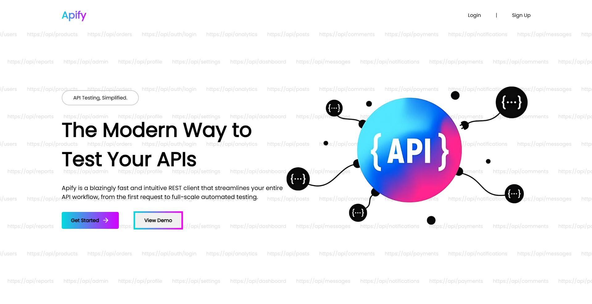

# Apify-The-Api-Tester
Apify - A Modern API Tester
A sleek and modern, browser-based API testing client designed for developers. Inspired by professional tools like Postman and Insomnia, Apify aims to provide a fast, clean, and intuitive interface to craft, send, and analyze HTTP requests directly in your browser.

About The Project
In today's development landscape, interacting with APIs is a daily task. Apify was created to streamline this process, offering a lightweight and accessible alternative to heavy desktop applications. It provides the core functionality needed to test and debug APIs effectively, with a focus on a clean user experience and organized workflow.

This project is built with a modern frontend and a robust backend to handle user authentication and data persistence.

Features Implemented (Frontend)
This version of the Apify frontend includes a rich set of features designed for a professional workflow:

Modern User Interface: A clean, responsive three-panel layout (Collections/History, Request, Response) for a clear and organized workspace.

Advanced Request Organization:

Collections: Create and manage collections (folders) to save and organize related API requests.
History: A separate view to access a chronological log of all sent requests.
Search: Instantly search through your collections and history.
Powerful Request Builder:

Full HTTP Method Support: Select from GET, POST, PUT, PATCH, and DELETE.
Tabbed Interface: Work on multiple requests simultaneously without losing context.
Params, Headers, and Body Tabs: Dedicated UI for managing Query Parameters, HTTP Headers, and the request Body.
Detailed Response Viewer:

Rich Metadata: Instantly see the response Status (e.g., 200 OK), Time, and Size.
Color-Coded Status: Response status codes are colored for immediate visual feedback (Green for 2xx, Red for errors).
Separate Body/Headers/Cookies Tabs: Inspect every part of the response in a structured way.
User Experience Enhancements:

User Authentication: A complete Register, Login, and Logout flow to protect user data.
Beautiful Notifications: Integrated SweetAlert2 for elegant and informative success, error, and confirmation popups.
Future Improvements & Backend Integration
While the frontend UI is well-established, the next phase of development will focus on full backend integration to make these features dynamic and persistent.

Saving Collections & Requests:

Goal: Implement backend endpoints (/api/collections, /api/requests) that allow users to save their collections and individual requests to the database, linked to their user ID.
Result: All saved requests will be permanently available whenever the user logs in.
Persistent History:

Goal: The backend will automatically log every request a user sends to a history table in the database.
Result: The History tab will show a user's complete request history across all their sessions.
Environments & Variables:

Goal: Create backend models and endpoints for storing user-defined environments (e.g., "Local," "Production") and variables ({{baseUrl}}, {{authToken}}).
Result: Users can define variables once and use them across all their requests, with settings saved to their account.
Full Sync Across Devices:

Goal: With all data stored on the backend, a user will be able to log in from any browser on any device and have their complete workspace (collections, history, environments) instantly available.
Technologies Used
Frontend:
HTML5
CSS3 (with CSS Variables for theming)
JavaScript (ES6+)
SweetAlert2
Backend:
Node.js
Express.js
Database:
MySQL (using the mysql2 library)
Authentication:
JSON Web Tokens (jsonwebtoken) for session management.
bcryptjs for secure password hashing.
